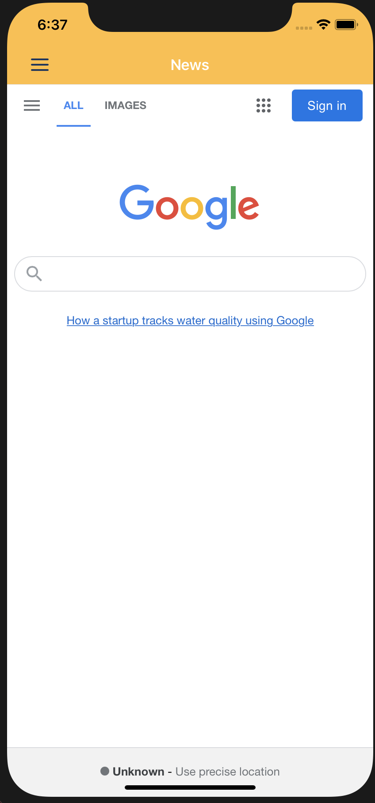
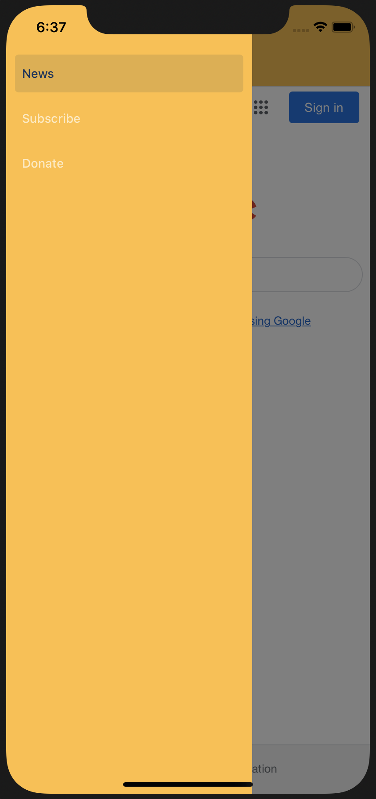
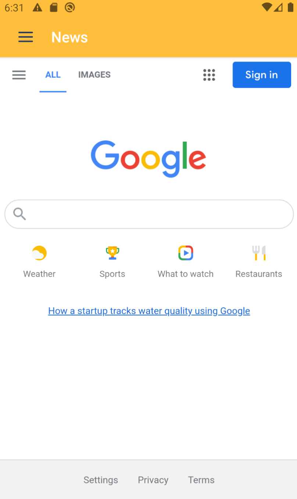
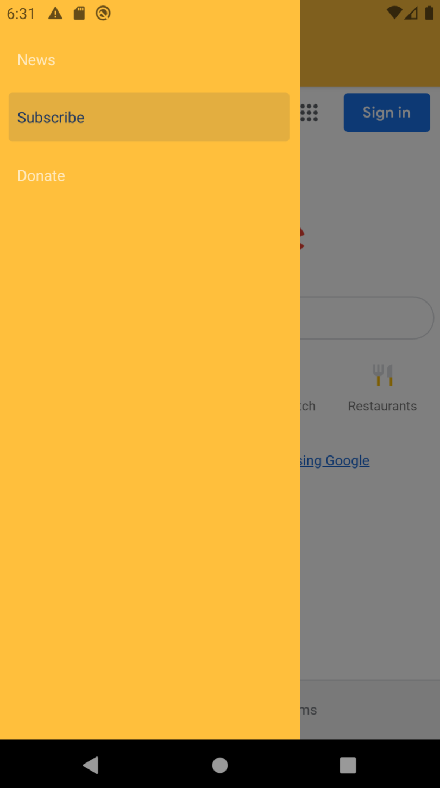

# React Native Webview Template With Menu

This template is to provide a boiler plate in making an application for both iOS and Android utilizing a navigation and displaying webviews per page.

Uses: React Native 0.63, React Navigation 5.0, Typescript

This project utilized Expo v39 resources and was ejected.  It includes a lot of resources such as location and notification handles autolinked into the project.

Sets up for you: menu title, drawer navigation, tests (with jest), hooks, deep linking, custom font support, splash screen, dark/light mode support.

# Preview

# Installation

We recommend using `react-native-rename` to rename your project to what you'd like.  Afterwhich, go through the proper procedure for both iOS and Android to change your resource names.

Simply run a `npm install` on first go around and then for iOS run `pod install` under the `ios` directory.  After, you should be able to run `react-native run ios` or `android` to start up the app right away!

This README expects you already know how to setup and use `react-native`.

## Android

I did attempt to remove `expo-location` as if you attempt to deploy to the android play store, it will complain you are request location services and see to provide details as to why.  Though, the app does not use location, the fact it was present in the binary, you wouldn't be able to deploy your app if you were not needing location services.  With this in mind, you'll want to re-add `expo-location` or a similiar location service plugin or use your own.  Since this project was a eject of `expo` it included a lot of handy auto-linked modules.  

# License

[MIT License](https://opensource.org/licenses/MIT)
